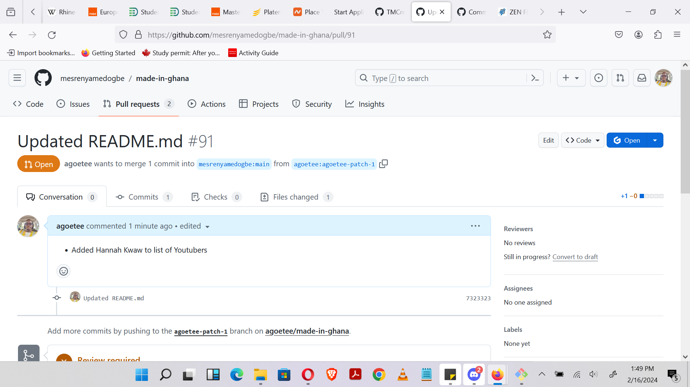

# 100 days of code progress log

## Day 1: 15 February 2024

__Today's Learning:__ Revision of these vital concepts:

- __Git__ - It's a software installed of a computer for version control purposes
    __Version Control__ Is the act of keeping a saved copy of a stage in a task
- __Github__ - Where we are now is a website to store the information about version controlling
- __linux command line(CLI)__ Came back to some basics of the command line. Since my Operation System is a __windows__, I used __vagrant__ which is a virtual machine platform that can house a __linux__ environment
- __open source__ in which projects can be open for anyone with the skills can contribute to it to make it a whole.

## Day 2: 16 February 2024

__Today's Learning:__ Assignment from Class:

- __forked__ a repository. Tutor created a repo that we were supposed to do the following: We clone the __fork__
- __created a branch__ with the method of using using full name initials and add __/goals__. My full name is Charles Tawiah Agoe therefore my branch will look like this: `CTA/goals`. We then will make changes by enetering our goals for joining the __Slightly Techie__ schools.
- __pushed__ the changes to the remote repository.
- make __pull request__. For my changes to be joined to the original repo, i made a pull request

**team work** 
The previous day the usual class rep could not make it so i was tasked to remind the tutor on saturday about the class. After posting the reminders, this colleague reached out so we go through some concepts. So we scheduled for the evening and we went through some __git__ and __github__ flow.

## Day 3: 17 February 2024

__Today's Learning:__ Concepts from Class:

### Git and GitHub
- __assigned reviewers to a pull request__ To experience how the workflow behaves in an organisation we assigned reviewers to each other
- __approved pull requests__ Those that had the chance approved some pull requests. Others also declined with comments for corrections to be done.
### open Source
- I forked a repository that was compiling Ghanaian tech communities and I hope to add a youtube channel I know of.


## Day 4: 18 February 2024

__Today's Learning__: Open Source

- I made an addition to the repository compiling Ghanaian tech communities, where I included a youtube channel by Hannah Kwaw. It got accepted and merged. Really happy



## Day 5: 19 February 2024

__Today's Learning__: Python concepts

- __Variable naming Convention__ A good variable name describes the data with which it contains. A descriptive name will make code reading more understandable. The following conventions are used:
    * __camel case__ : `baaYe`
    * __underscores__ : `baa_ye`

- __Name Restrictions__ 
    - Must not have spaces(only one word)
    - Can only use letters, numbers and underscores
    - cannot begin with a number

- Others

    |Valid|Invalid|
    |:---:|:---:|
    |current_balance|current-balance|
    |currentBalance|current balance (no space)|
    |account4|4account (cannot start with int)|
    |_42|42(cannot start with int)|
    |TOTAL_SUM|TOTAL_$UM (cannot have special x'ters)|
    |hello|'hello' (cannot have special x'ters)|

    - __Spam__ is a valid variable name but it is a convention to start a variable with `lowercase`


## Day 6: 20 February 2024

__Today's Learning__: Python variables Deep dive

- __variables__ are there to hold data during run-time
- __Contains__ three parts: __name__, __assignment__ and __value__. This is shown like this 
`age = 25`
__age__ is the name,
__=__ is the assignment, and
__25__ is the value. In this case, its an `integer`

- __Variable unpacking__ A situation where several variables are declared with __one__ assignment operator. eg.
`first_name, last_name, age = 'Charles', 'Agoe', 21`. 

## Day 7: 21 February 2024

__Today's Learning__: Reading concepts-

- __interpreted vs Compiled language__ Computer understands `0`'s and `1`'s, known as binary which humans do not understand. Therefore the compilers and interpretors translate from human readable to machine language.

- __PEP8__ is a styling regime

- __Modules, Packages and Libraries__ programs in a python file are exported/imported to other programs as __modules__. A group of modules form a __package__. It is important that packages have the `__init__.py` file in them

## Day 8: 22 February 2024

__Today's Learning__: Class study Control Flow

__Control Flows__ centers on decision making and how a program is executed

Control flow comprises of a lot of things:

- if statements
- for loops
- while loops

## Day 9: 23 February 2024

__Today's Learning__: Class study Conditionals (if statements)

Conditionals have a structure. It consists of the following:
- conditional keyword (`if`, `elif` and `else`)
- condition (`a == 2`)
- a colon (`:`) at the end of the line
- indentation of the next line.

__example__

```py
# A program to group age of students into different levels.
age = int(input("Enter your age: "))

if age > 15:
    print("You have crossed High school level")
elif age > 12 and age <= 15:
    print("You are in JHS)
elif age >= 6 and age <= 12:
    print("You are in Primary school")
else:
    print("Kingdergarten be that oo")
```

Code runs from top to buttom. It starts from the `if` statement and evaluates it. It the evaluation returns `true`, that block runs.

If it evaluates to `false`, execution continues to the `elif` statement with same approach. each one that evaluates to true is executed then the code exits.

## Day 10: 24 February 2024

__Today's Learning__: Personal Readings __LOOPS__

Loops are used to cycle through iterables. There are _2_ types in python:

- __for loop__ repeats a cycle of code a specified number of times

- __while loop__ repeats a variable number of times example when the number will be determined by a user input.

## Day 11: 24 February 2024

__Today's Learning__: Class study: Data Types and For loops

- __Data Type__ is a kind of data that tells what kind of operation that can be executed on it. Examples are:
    - `int` eg 28
    - `str` eg 'Akosua'
    - `float` eg 28.5
    - `bool` eg `True`
    - `set` eg `set()` unique values
    - `dist` eg {'key': 'value'}
    - etc

- __for loop__
```py
students = ["Panford", "Charles", "Prinston", "Emmanuel", "Ken"]

for name in students:
    print(name)
```

__name__ is an _element_ in the iterable __students__

other _iterables_ are: `list`, `string`

